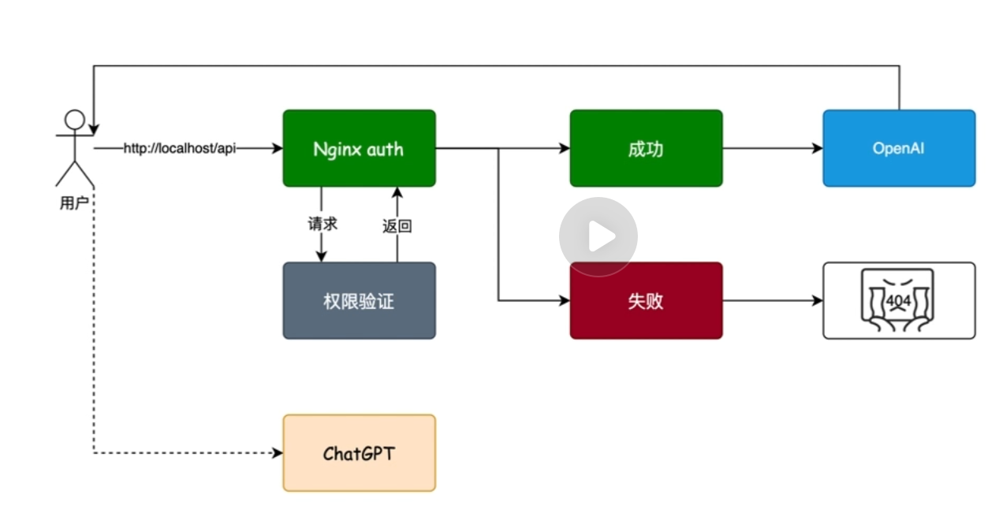
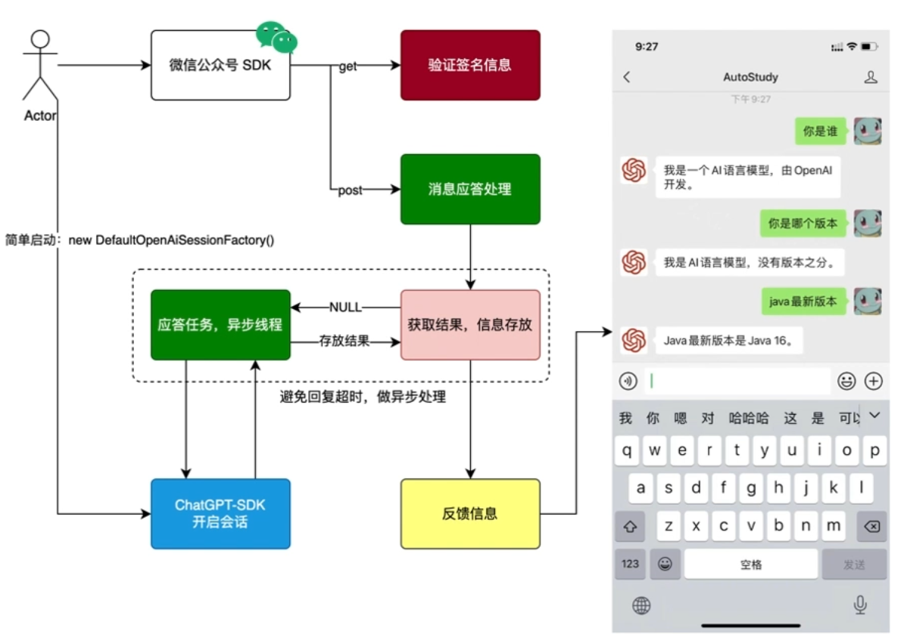

## 使用Nginx实现简单访问认证

> 访问Nginx 127.0.0.1:80/api?token=tokenstr 
> Nginx转向访问 127.0.0.1:80/auth?token=tokenstr ,auth操作向tomcat服务器访问127.0.0.1:8080/verify?token=tokenstr 
> verify成功后， Nginx访问127.0.0.1:8080/success，否则返回错误页面 

## 微信公众号验签和对接OpenAI

